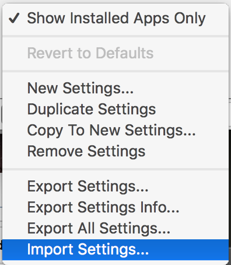

simple settings file for the [SHUTTLE EXPRESS](http://www.contourdesign.com/UK/product/shuttlexpress/) for [SCREENFLOW](https://www.telestream.net/screenflow/overview.htm)

• jog wheel frame by frame scrubbing
• shuttle zones for quicker scrubbing
• button 01 - start of session
• button 02 - zoom out
• button 03 - play/pause
• button 04 - zoom in
• button 05 - split

INSTALL
------
in the contour shuttle application. click on the small cog located on the bottom left & click on 'import settings'

then just locate the setting file from this download

have phün & happy editing

[lewis lepton](https://lewislepton.com)